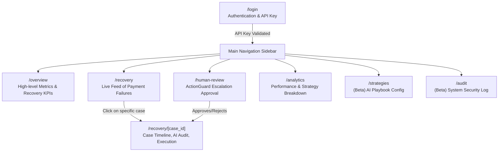

# RecoverAI Frontend Console

Next.js-based real-time observability dashboard for tracking payment recovery cases, metrics, and ActionGuard policy decisions.

## Features
- **Metrics Observability**: Track Revenue at Risk, Total Revenue Recovered, Recovery Rate, and Guard Block Rate.
- **Queue Control**: Filter recovery cases by status (Blocked, Human Review, Recovered, etc.) and risk scores.
- **Detailed Timelines**: View structured, append-only decision audit trails generated by the AI Council.
- **Security Authorization Audit**: Displays action identifiers, token masks, and simulator execution outcomes.

## Getting Started

### Prerequisites
- Node.js (v20 or higher)
- pnpm (v9 or higher)

### Environment Variables
Create a `.env.local` file in the root directory:
```env
NEXT_PUBLIC_API_URL=http://localhost:8000
```

### Setup & Run
1. Install dependencies:
   ```bash
   pnpm install
   ```
2. Start the development server:
   ```bash
   pnpm run dev
   ```
3. Open [http://localhost:3000](http://localhost:3000) and enter `RECOVERAI-TESTKEY-12345` as the Server API Key to unlock cases (or login via Google OAuth if configured).

### Architecture & Connections
The frontend connects directly to the **RecoverAI Backend Engine** (`http://localhost:8000`) for:
- Fetching aggregated metrics and real-time case data
- Submitting ActionGuard human overrides
- Listening to Server-Sent Events (SSE) for real-time dashboard updates

## User Interface Flow

The following diagram illustrates the primary pages of the RecoverAI dashboard, their purpose, and how users navigate between them.


